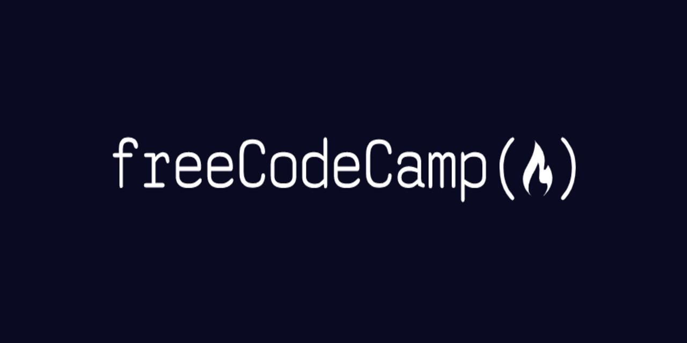

---

* [X] **Basic JavaScrip**t: `113/113` - fundamental programming concepts in JavaScript. You'll start with basic data structures like numbers and strings. Then you'll learn to work with arrays, objects, functions, loops, if/else statements, and more.
* [X] **ES6**: `29/29` - ES6, released in 2015, added many powerful new features to the language. In this course, you'll learn these new features, including arrow functions, destructuring, classes, promises, and modules.
* [X] **Regular Expressions**:  `33/33` - how to use special characters, capture groups, positive and negative lookaheads, and other techniques to match any text you want.
* [X] **Debugging**: `12/12` - how to use the JavaScript console to debug programs and prevent common issues before they happen.
* [X] **Basic Data Structures**:` 20/20` - differences between arrays and objects, and which to use in different situations. You'll also learn how to use helpful JS methods like `splice()` and `Object.keys()` to access and manipulate data.
* [X] **Basic Algorithm Scripting**: `16/16` - the fundamentals of algorithmic thinking by writing algorithms that do everything from converting temperatures to handling complex 2D arrays.
* [X] **Object Oriented Programming**: `26/26` - the basic principles of OOP in JavaScript, including the `this` keyword, prototype chains, constructors, and inheritance.
* [X] **Functional Programming**: `24/24` - the core concepts of Functional Programming including pure functions, how to avoid mutations, and how to write cleaner code with methods like `.map()` and `.filter()`.
* [X] **Intermediate Algorithm Scripting**: `21/21` - the Intermediate Algorithm Scripting challenges.
* [X] **JavaScript Algorithms and Data Structures Projects**: `5/5` - Final Projects

---
